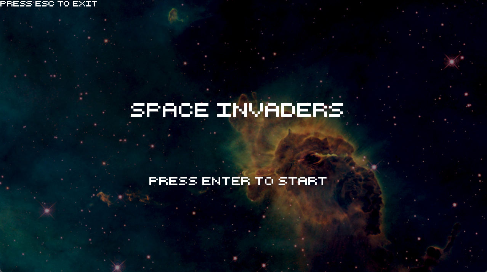
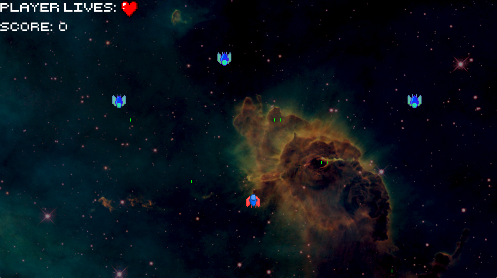
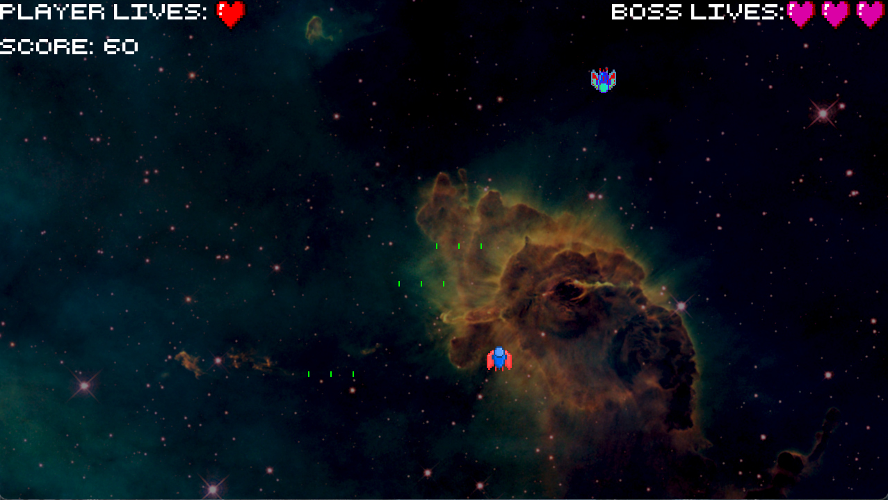

# Space Invaders

  
  
  

## Description
  - This project is inspired by the shooter arcade game Space Invaders. In this version, the player controls a spaceship and must defeat a wave of aliens, then a final boss, while accumulating points throughout the game.
  - Controls: arrows to move, space to shoot.
  - Gameplay (of the original game): https://youtu.be/MU4psw3ccUI
  - The playable game is available in the latest release.
  
## Code Design

  - The project uses SFML for graphics and input, and for CI it uses GitHub Actions.
  - The code has no warnings and no memory leaks, being tested with Sanitizers and Valgrind. It was organized in headers and source files, the project being built using CMake.
  - Amongst the OOP concepts used, some of the featured ones are: all the basic principles of OOP, overloaded and overridden constructors and operators, the use of keywords 'const' and 'static', downcasting and upcasting, virtualization, exceptions, smart pointers, dynamic cast, template classes and functions, STL containers and design patterns.
  
## Resources

- [SFML](https://github.com/SFML/SFML/tree/aa82ea132b9296a31922772027ad5d14c1fa381b) (Zlib)
- Textures were made using GraphicsGale.