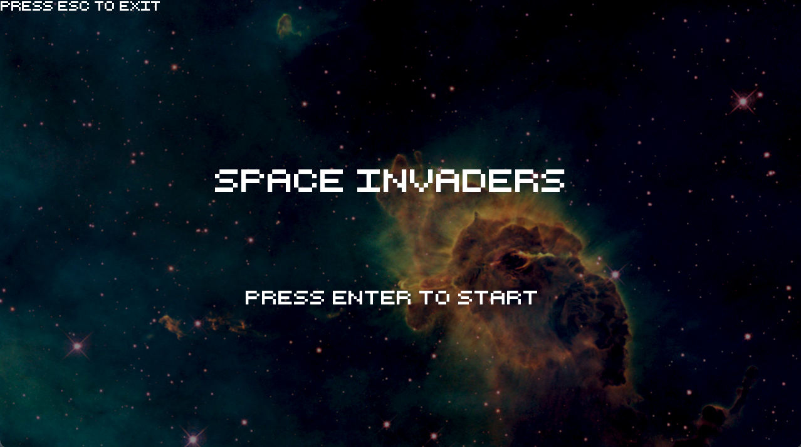
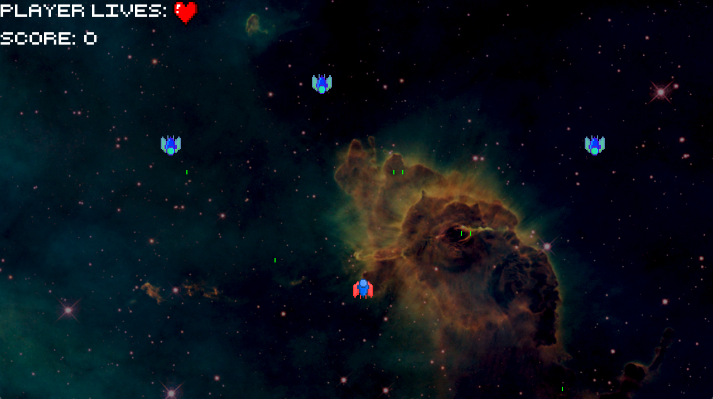
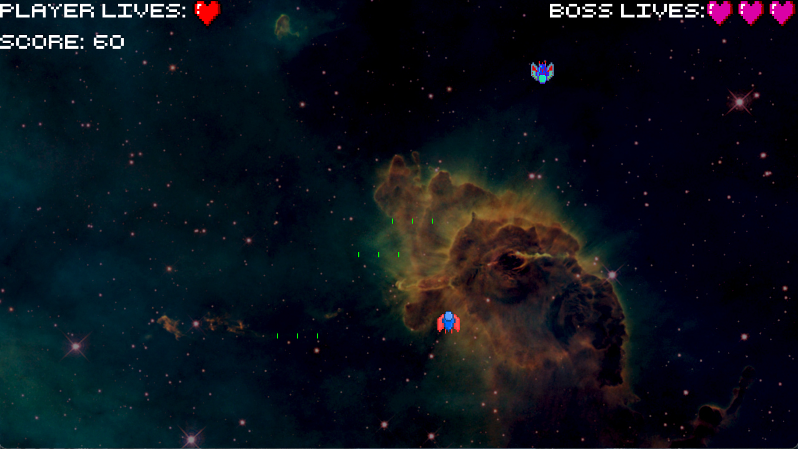

# Space Invaders

  
  
  

  - Space Invaders este un joc arcade, de tip shooter, ce a aparut la sfarsitul anilor '70 in Japonia. In aceasta versiune, jucatorul controleaza o nava spatiala si trebuie sa infranga, mai intai, un wave de extraterestri, apoi un inamic final, acumuland puncte pe tot parcursul jocului. 
  - Controale: sageti pentru miscare, space pentru a trage.
  - Gameplay (al jocului original): https://youtu.be/MU4psw3ccUI
  - Proiectul foloseste SFML pentru grafica si input al jucatorului, iar pentru CI am folosit GitHub Actions.
  - De asemenea, printre conceptele de OOP folosite, se regasesc: toate principiile de baza ale OOP, rescrierea constructorilor si a operatorilor, folosirea keyword-urilor 'const' si 'static', downcasting si upcasting, virtualizare, exceptii, smart pointers, design patterns si template.

## Tema 1
  - Pentru Tema 1 am implementat o prima parte a jocului, in care jucatorul trebuie sa castige in fata unui singur inamic.
    - De asemenea, printre primele commit-uri se gaseste si inceputul unui alt proiect ce verifica cerintele - letterboxd. 
#### Cerințe
- [x] definirea a minim 3-4 clase folosind compunere
- [x] constructori de inițializare
- [x] pentru o clasă: constructor de copiere, `operator=` de copiere, destructor
<!-- - [ ] pentru o altă clasă: constructor de mutare, `operator=` de mutare, destructor -->
<!-- - [ ] pentru o altă clasă: toate cele 5 funcții membru speciale -->
- [x] `operator<<` pentru toate clasele pentru afișare (std::ostream)
- [x] cât mai multe `const` (unde este cazul)
- [x] implementarea a minim 3 funcții membru publice pentru funcționalități specifice temei alese
- [x] scenariu de utilizare a claselor definite:
  - crearea de obiecte și apelarea funcțiilor membru publice în main
  - vor fi adăugate în fișierul `tastatura.txt` exemple de date de intrare de la tastatură (dacă există)
- [x] tag de `git`: de exemplu `v0.1`
- [x] serviciu de integrare continuă (CI); exemplu: GitHub Actions

## Tema 2

#### Cerințe
- [x] separarea codului din clase în `.h` (sau `.hpp`) și `.cpp`
- [x] moșteniri
  - [x] clasă cu atribut de tip pointer la o clasă de bază cu derivate
  - [x] funcții virtuale (pure) apelate prin pointeri de bază din clasa de mai sus, constructori virtuali (clone)
    - minim o funcție virtuală va fi **specifică temei** (e.g. nu simple citiri/afișări)
  - [x] apelarea constructorului din clasa de bază din constructori din derivate
  - [x] smart pointers
  - [x] `dynamic_cast`
- [x] suprascris cc/op= pentru copieri/atribuiri corecte, copy and swap
- [x] excepții
  - [x] ierarhie proprie cu baza `std::exception` sau derivată din `std::exception`; minim 2 clase pentru erori specifice
  - [x] utilizare cu sens: de exemplu, `throw` în constructor, `try`/`catch` în `main`
- [x] funcții și atribute `static`
- [x] STL
- [x] cât mai multe `const`
- [x] la sfârșit: commit separat cu adăugarea unei noi derivate fără a modifica restul codului
- [x] tag de `git`: de exemplu `v0.2`

## Tema 3

#### Cerințe
- [x] 2 șabloane de proiectare (design patterns)
- [x] o funcție șablon (template) cu sens; minim 2 instanțieri
- [x] o clasă șablon cu sens; minim 2 instanțieri
<!-- - [ ] o specializare pe funcție/clasă șablon -->
- [x] tag de `git`: de exemplu `v0.3` sau `v1.0`

## Resurse

- [SFML](https://github.com/SFML/SFML/tree/aa82ea132b9296a31922772027ad5d14c1fa381b) (Zlib)
- O parte dintre imaginile folosite pentru texturi au fost preluate din repo-ul https://github.com/Th3NiKo/Space-Invaders, restul fiind facute folosind GraphicsGale.